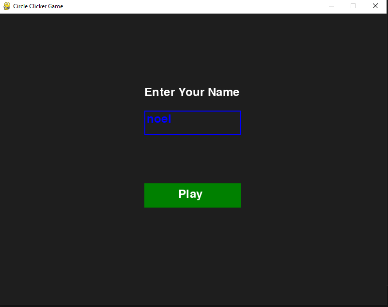
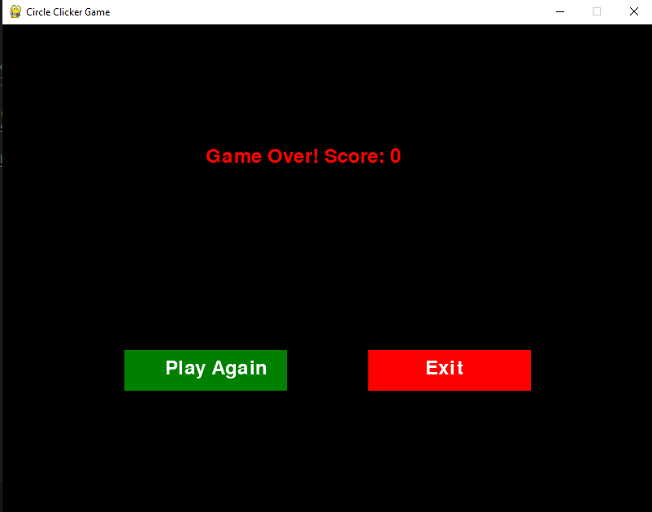
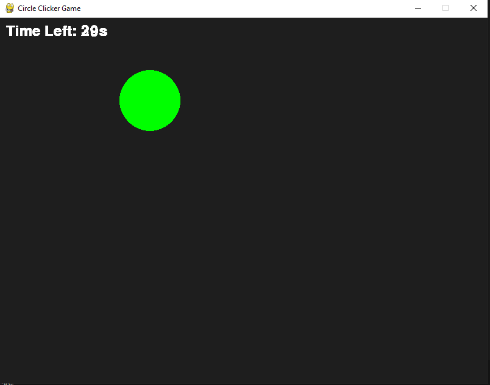

# Circle Clicker
## CS110 Final Project,  Fall 2024

## Team Members

Noel Maldonado

***

## Project Description

A game where you earn points by clicking the circles. Circles spawn in random places.

***    

## GUI Design

### Initial Design

### Final Design

## Program Design

### Features

1. start menu
2. circle spawn in random spot
3. click gives points and spawns new circle
4. pause menu
5. game over menu
6. database holding the highest score and player

### Classes

- Database - Creates a database where the highest score is stored.
- Game - Initializes the game including the circles and links to database.

## ATP

| Step                 |Procedure             |Expected Results                   |
|----------------------|:--------------------:|------------------------------------------------------------------------------:|
|  1                   | Run Controller       |GUI appears prompting username with a play button                              |
|  2                   | Click play button    |Game starts, 30 second timer starts                                            |
|  3                   | Click Circles        |Point counter goes up by 5, new circle spawns in, countdown reset              |
|  4                   | Game over            |Game over GUI pops up, shows score and high score. option to play again or quit|