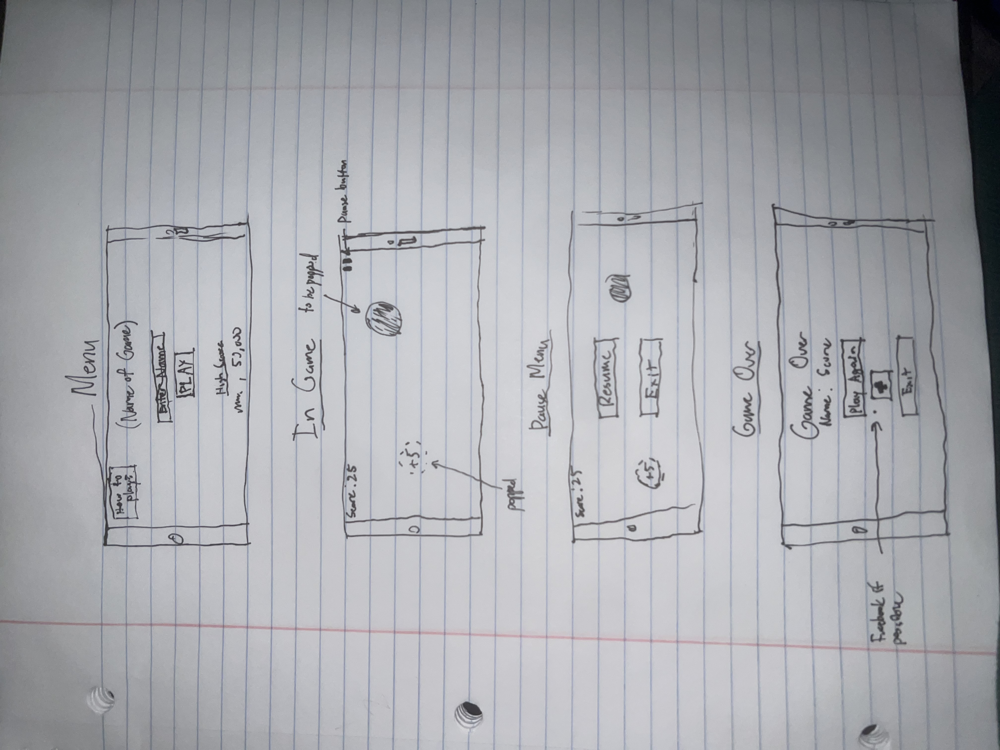

:warning: Everything between << >> needs to be replaced (remove << >> after replacing)

# Circle Clicker
## CS110 Final Project  Fall, 2024

## Team Members

Noel Maldonado

***

## Project Description

A game where you earn points by clicking the circles. Circles spawn in random places.

***    

## GUI Design

### Initial Design

### Final Design

## Program Design

### Features

1. start menu
2. circle spawn in random spot
3. click gives points and spawns new circle
4. pause menu
5. game over menu
6. database holding the highest score and player

### Classes

- Circle - Initializes circle and puts it in random place.
- Points - Adds points when screen is clicked where the circle is located.

## ATP

| Step                 |Procedure             |Expected Results                   |
|----------------------|:--------------------:|----------------------------------:|
|  1                   | Run Counter Program  |GUI window appears with count = 0  |
|  2                   | click count button   | display changes to count = 1      |
etc...
